<!-- Generated by scripts/gen-doc-graphs.ts - do not edit by hand.
     Run `pnpm run gen-doc-graphs` to regenerate. -->

# DSH Base Composition

The dsh-base bundle patch every profile applies first; mode bundles (dsh-web-app, dsh-headless) and the user's profile layer patch over it.

```mermaid
flowchart LR
  cfg["packages/bundle/base/cordis.patch.yml<br/>cordis.yml"]
  plugin_dsh_base_timer["timer<br/>@xneog/cordis-plugin-timer"]
  cfg --> plugin_dsh_base_timer
  plugin_dsh_base_hmr["hmr<br/>@xneog/cordis-plugin-hmr"]
  cfg --> plugin_dsh_base_hmr
  plugin_dsh_base_llm["llm<br/>@xneog/dsh-llm"]
  cfg --> plugin_dsh_base_llm
  plugin_dsh_base_session["session<br/>@xneog/dsh-session"]
  cfg --> plugin_dsh_base_session
  plugin_dsh_base_typert["typert<br/>@xneog/dsh-typert-registry"]
  cfg --> plugin_dsh_base_typert
  plugin_dsh_base_typert_loader["typert-loader<br/>@xneog/dsh-typert-loader"]
  cfg --> plugin_dsh_base_typert_loader
  plugin_dsh_base_typert_gateway["typert-gateway<br/>@xneog/dsh-api-gateway"]
  cfg --> plugin_dsh_base_typert_gateway
  plugin_dsh_base_session_title["session-title<br/>@xneog/dsh-session-title"]
  cfg --> plugin_dsh_base_session_title
  plugin_dsh_base_session_title_llm["session-title-llm<br/>@xneog/dsh-session-title-first-prompt-llm"]
  cfg --> plugin_dsh_base_session_title_llm
  plugin_dsh_base_user_questions["user-questions<br/>@xneog/dsh-user-questions"]
  cfg --> plugin_dsh_base_user_questions
  plugin_dsh_base_agent["agent<br/>@xneog/dsh-agent"]
  cfg --> plugin_dsh_base_agent
  plugin_dsh_base_agent_default_model["agent-default-model<br/>@xneog/dsh-agent-default-model"]
  cfg --> plugin_dsh_base_agent_default_model
  plugin_dsh_base_jobs["jobs<br/>@xneog/dsh-jobs-local"]
  cfg --> plugin_dsh_base_jobs
  plugin_dsh_base_llm_retry["llm-retry<br/>@xneog/dsh-llm-retry"]
  cfg --> plugin_dsh_base_llm_retry
  plugin_dsh_base_settings["settings<br/>@xneog/dsh-settings-file"]
  cfg --> plugin_dsh_base_settings
  plugin_dsh_base_credentials["credentials<br/>@xneog/dsh-credentials-local"]
  cfg --> plugin_dsh_base_credentials
  plugin_dsh_base_llm_pi_ai["llm-pi-ai<br/>@xneog/dsh-llm-pi-ai"]
  cfg --> plugin_dsh_base_llm_pi_ai
  plugin_dsh_base_session_persistence_jsonl["session-persistence-jsonl<br/>@xneog/dsh-session-persistence-jsonl"]
  cfg --> plugin_dsh_base_session_persistence_jsonl
  plugin_dsh_base_attachment_local["attachment-local<br/>@xneog/dsh-attachment-local"]
  cfg --> plugin_dsh_base_attachment_local
  plugin_dsh_base_session_query_sqlite["session-query-sqlite<br/>@xneog/dsh-session-query-sqlite"]
  cfg --> plugin_dsh_base_session_query_sqlite
  plugin_dsh_base_session_projection["session-projection<br/>@xneog/dsh-session-projection"]
  cfg --> plugin_dsh_base_session_projection
  plugin_dsh_base_session_telemetry_otel["session-telemetry-otel<br/>@xneog/dsh-session-telemetry-otel"]
  cfg --> plugin_dsh_base_session_telemetry_otel
  plugin_dsh_base_subprocess["subprocess<br/>@xneog/dsh-subprocess-local"]
  cfg --> plugin_dsh_base_subprocess
  plugin_dsh_base_sandbox["sandbox<br/>@xneog/dsh-sandbox-local"]
  cfg --> plugin_dsh_base_sandbox
  plugin_dsh_base_sandbox_policy["sandbox-policy<br/>@xneog/dsh-sandbox-policy"]
  cfg --> plugin_dsh_base_sandbox_policy
  plugin_dsh_base_bash_sandbox["bash-sandbox<br/>@xneog/dsh-bash-sandbox"]
  cfg --> plugin_dsh_base_bash_sandbox
  plugin_dsh_base_pwsh_sandbox["pwsh-sandbox<br/>@xneog/dsh-pwsh-sandbox"]
  cfg --> plugin_dsh_base_pwsh_sandbox
  plugin_dsh_base_approval["approval<br/>@xneog/dsh-user-approval"]
  cfg --> plugin_dsh_base_approval
  plugin_dsh_base_permission["permission<br/>@xneog/dsh-permission-presets"]
  cfg --> plugin_dsh_base_permission
  plugin_dsh_base_shell_env["shell-env<br/>@xneog/dsh-shell-env"]
  cfg --> plugin_dsh_base_shell_env
  plugin_dsh_base_tool_bash["tool-bash<br/>@xneog/dsh-tool-bash"]
  cfg --> plugin_dsh_base_tool_bash
  plugin_dsh_base_tool_pwsh["tool-pwsh<br/>@xneog/dsh-tool-pwsh"]
  cfg --> plugin_dsh_base_tool_pwsh
  plugin_dsh_base_tool_jobs["tool-jobs<br/>@xneog/dsh-tool-jobs"]
  cfg --> plugin_dsh_base_tool_jobs
  plugin_dsh_base_fs_observation_policy["fs-observation-policy<br/>@xneog/dsh-fs-observation-policy"]
  cfg --> plugin_dsh_base_fs_observation_policy
  plugin_dsh_base_tool_fs["tool-fs<br/>@xneog/dsh-tool-fs"]
  cfg --> plugin_dsh_base_tool_fs
  plugin_dsh_base_tool_fs_search["tool-fs-search<br/>@xneog/dsh-tool-fs-search"]
  cfg --> plugin_dsh_base_tool_fs_search
  plugin_dsh_base_agent_instructions["agent-instructions<br/>@xneog/dsh-agent-instructions"]
  cfg --> plugin_dsh_base_agent_instructions
  plugin_dsh_base_skill["skill<br/>@xneog/dsh-skill"]
  cfg --> plugin_dsh_base_skill
  plugin_dsh_base_skill_filesystem["skill-filesystem<br/>@xneog/dsh-skill-filesystem"]
  cfg --> plugin_dsh_base_skill_filesystem
  plugin_dsh_base_skill_badge["skill-badge<br/>@xneog/dsh-skill-badge"]
  cfg --> plugin_dsh_base_skill_badge
  plugin_dsh_base_tool_skill["tool-skill<br/>@xneog/dsh-tool-skill"]
  cfg --> plugin_dsh_base_tool_skill
  plugin_dsh_base_commands["commands<br/>@xneog/dsh-commands"]
  cfg --> plugin_dsh_base_commands
  plugin_dsh_base_command_feedback["command-feedback<br/>@xneog/dsh-command-feedback"]
  cfg --> plugin_dsh_base_command_feedback
  plugin_dsh_base_goal["goal<br/>@xneog/dsh-goal"]
  cfg --> plugin_dsh_base_goal
  plugin_dsh_base_goal_round_driver["goal-round-driver<br/>@xneog/dsh-goal-round-driver"]
  cfg --> plugin_dsh_base_goal_round_driver
  plugin_dsh_base_command_goal["command-goal<br/>@xneog/dsh-command-goal"]
  cfg --> plugin_dsh_base_command_goal
  plugin_dsh_base_plan_mode["plan-mode<br/>@xneog/dsh-plan-mode"]
  cfg --> plugin_dsh_base_plan_mode
  plugin_dsh_base_token_meter["token-meter<br/>@xneog/dsh-token-meter"]
  cfg --> plugin_dsh_base_token_meter
  plugin_dsh_base_compaction_basic["compaction-basic<br/>@xneog/dsh-compaction-basic"]
  cfg --> plugin_dsh_base_compaction_basic
  plugin_dsh_base_command_compact["command-compact<br/>@xneog/dsh-command-compact"]
  cfg --> plugin_dsh_base_command_compact
  plugin_dsh_base_subagent["subagent<br/>@xneog/dsh-subagent"]
  cfg --> plugin_dsh_base_subagent
  plugin_dsh_base_subagent_spawn_in_process["subagent-spawn-in-process<br/>@xneog/dsh-subagent-spawn-in-process"]
  cfg --> plugin_dsh_base_subagent_spawn_in_process
  plugin_dsh_base_subagent_fork_in_process["subagent-fork-in-process<br/>@xneog/dsh-subagent-fork-in-process"]
  cfg --> plugin_dsh_base_subagent_fork_in_process
  plugin_dsh_base_tool_subagent_control["tool-subagent-control<br/>@xneog/dsh-tool-subagent-control"]
  cfg --> plugin_dsh_base_tool_subagent_control
  plugin_dsh_base_tool_subagent_list_agents["tool-subagent-list-agents<br/>@xneog/dsh-tool-subagent-control/list-agents"]
  cfg --> plugin_dsh_base_tool_subagent_list_agents
  plugin_dsh_base_tool_subagent["tool-subagent<br/>@xneog/dsh-tool-subagent"]
  cfg --> plugin_dsh_base_tool_subagent
  plugin_dsh_base_tool_subagent_fork["tool-subagent-fork<br/>@xneog/dsh-tool-subagent"]
  cfg --> plugin_dsh_base_tool_subagent_fork
  plugin_dsh_base_tool_subagent_report["tool-subagent-report<br/>@xneog/dsh-tool-subagent-report"]
  cfg --> plugin_dsh_base_tool_subagent_report
  plugin_dsh_base_workflow_worker_thread["workflow-worker-thread<br/>@xneog/dsh-workflow-worker-thread"]
  cfg --> plugin_dsh_base_workflow_worker_thread
  plugin_dsh_base_tool_workflow["tool-workflow<br/>@xneog/dsh-tool-workflow"]
  cfg --> plugin_dsh_base_tool_workflow
  plugin_dsh_base_timeout_policy["timeout-policy<br/>@xneog/dsh-tool-call-timeout-policy"]
  cfg --> plugin_dsh_base_timeout_policy
  plugin_dsh_base_spill_local["spill-local<br/>@xneog/dsh-spill-local"]
  cfg --> plugin_dsh_base_spill_local
  plugin_dsh_base_spill_policy["spill-policy<br/>@xneog/dsh-spill-policy"]
  cfg --> plugin_dsh_base_spill_policy
  plugin_dsh_base_session_checkpoint_policy["session-checkpoint-policy<br/>@xneog/dsh-session-checkpoint-policy"]
  cfg --> plugin_dsh_base_session_checkpoint_policy
  plugin_dsh_base_tool_result_pruner["tool-result-pruner<br/>@xneog/dsh-compaction-tool-result-pruner"]
  cfg --> plugin_dsh_base_tool_result_pruner
  plugin_dsh_base_tool_todo["tool-todo<br/>@xneog/dsh-tool-todo"]
  cfg --> plugin_dsh_base_tool_todo
  plugin_dsh_base_tool_goal["tool-goal<br/>@xneog/dsh-tool-goal"]
  cfg --> plugin_dsh_base_tool_goal
  plugin_dsh_base_tool_ralph["tool-ralph<br/>@xneog/dsh-tool-ralph"]
  cfg --> plugin_dsh_base_tool_ralph
  plugin_dsh_base_tool_str_replace_editor["tool-str-replace-editor<br/>@xneog/dsh-tool-str-replace-editor"]
  cfg --> plugin_dsh_base_tool_str_replace_editor
  plugin_dsh_base_repeat_tool_reminder["repeat-tool-reminder<br/>@xneog/dsh-repeat-tool-reminder"]
  cfg --> plugin_dsh_base_repeat_tool_reminder
  plugin_dsh_base_web["web<br/>@xneog/dsh-web"]
  cfg --> plugin_dsh_base_web
  plugin_dsh_base_web_search_deepseek["web-search-deepseek<br/>@xneog/dsh-web-search-deepseek"]
  cfg --> plugin_dsh_base_web_search_deepseek
  plugin_dsh_base_tool_web["tool-web<br/>@xneog/dsh-tool-web"]
  cfg --> plugin_dsh_base_tool_web
  plugin_dsh_base_tools["tools<br/>@xneog/dsh-tools"]
  cfg --> plugin_dsh_base_tools
  plugin_dsh_base_system_prompt["system-prompt<br/>@xneog/dsh-system-prompt"]
  cfg --> plugin_dsh_base_system_prompt
  plugin_dsh_base_agent_loop["agent-loop<br/>@xneog/dsh-agent-loop"]
  cfg --> plugin_dsh_base_agent_loop
  plugin_dsh_base_fs_sandbox["fs-sandbox<br/>@xneog/dsh-fs-sandbox"]
  cfg --> plugin_dsh_base_fs_sandbox
  plugin_dsh_base_llm_deepseek["llm-deepseek<br/>@xneog/dsh-llm-deepseek"]
  cfg --> plugin_dsh_base_llm_deepseek
```

| Plugin id | Package / module |
| --- | --- |
| `timer` | `@xneog/cordis-plugin-timer` |
| `hmr` | `@xneog/cordis-plugin-hmr` |
| `llm` | `@xneog/dsh-llm` |
| `session` | `@xneog/dsh-session` |
| `typert` | `@xneog/dsh-typert-registry` |
| `typert-loader` | `@xneog/dsh-typert-loader` |
| `typert-gateway` | `@xneog/dsh-api-gateway` |
| `session-title` | `@xneog/dsh-session-title` |
| `session-title-llm` | `@xneog/dsh-session-title-first-prompt-llm` |
| `user-questions` | `@xneog/dsh-user-questions` |
| `agent` | `@xneog/dsh-agent` |
| `agent-default-model` | `@xneog/dsh-agent-default-model` |
| `jobs` | `@xneog/dsh-jobs-local` |
| `llm-retry` | `@xneog/dsh-llm-retry` |
| `settings` | `@xneog/dsh-settings-file` |
| `credentials` | `@xneog/dsh-credentials-local` |
| `llm-pi-ai` | `@xneog/dsh-llm-pi-ai` |
| `session-persistence-jsonl` | `@xneog/dsh-session-persistence-jsonl` |
| `attachment-local` | `@xneog/dsh-attachment-local` |
| `session-query-sqlite` | `@xneog/dsh-session-query-sqlite` |
| `session-projection` | `@xneog/dsh-session-projection` |
| `session-telemetry-otel` | `@xneog/dsh-session-telemetry-otel` |
| `subprocess` | `@xneog/dsh-subprocess-local` |
| `sandbox` | `@xneog/dsh-sandbox-local` |
| `sandbox-policy` | `@xneog/dsh-sandbox-policy` |
| `bash-sandbox` | `@xneog/dsh-bash-sandbox` |
| `pwsh-sandbox` | `@xneog/dsh-pwsh-sandbox` |
| `approval` | `@xneog/dsh-user-approval` |
| `permission` | `@xneog/dsh-permission-presets` |
| `shell-env` | `@xneog/dsh-shell-env` |
| `tool-bash` | `@xneog/dsh-tool-bash` |
| `tool-pwsh` | `@xneog/dsh-tool-pwsh` |
| `tool-jobs` | `@xneog/dsh-tool-jobs` |
| `fs-observation-policy` | `@xneog/dsh-fs-observation-policy` |
| `tool-fs` | `@xneog/dsh-tool-fs` |
| `tool-fs-search` | `@xneog/dsh-tool-fs-search` |
| `agent-instructions` | `@xneog/dsh-agent-instructions` |
| `skill` | `@xneog/dsh-skill` |
| `skill-filesystem` | `@xneog/dsh-skill-filesystem` |
| `skill-badge` | `@xneog/dsh-skill-badge` |
| `tool-skill` | `@xneog/dsh-tool-skill` |
| `commands` | `@xneog/dsh-commands` |
| `command-feedback` | `@xneog/dsh-command-feedback` |
| `goal` | `@xneog/dsh-goal` |
| `goal-round-driver` | `@xneog/dsh-goal-round-driver` |
| `command-goal` | `@xneog/dsh-command-goal` |
| `plan-mode` | `@xneog/dsh-plan-mode` |
| `token-meter` | `@xneog/dsh-token-meter` |
| `compaction-basic` | `@xneog/dsh-compaction-basic` |
| `command-compact` | `@xneog/dsh-command-compact` |
| `subagent` | `@xneog/dsh-subagent` |
| `subagent-spawn-in-process` | `@xneog/dsh-subagent-spawn-in-process` |
| `subagent-fork-in-process` | `@xneog/dsh-subagent-fork-in-process` |
| `tool-subagent-control` | `@xneog/dsh-tool-subagent-control` |
| `tool-subagent-list-agents` | `@xneog/dsh-tool-subagent-control/list-agents` |
| `tool-subagent` | `@xneog/dsh-tool-subagent` |
| `tool-subagent-fork` | `@xneog/dsh-tool-subagent` |
| `tool-subagent-report` | `@xneog/dsh-tool-subagent-report` |
| `workflow-worker-thread` | `@xneog/dsh-workflow-worker-thread` |
| `tool-workflow` | `@xneog/dsh-tool-workflow` |
| `timeout-policy` | `@xneog/dsh-tool-call-timeout-policy` |
| `spill-local` | `@xneog/dsh-spill-local` |
| `spill-policy` | `@xneog/dsh-spill-policy` |
| `session-checkpoint-policy` | `@xneog/dsh-session-checkpoint-policy` |
| `tool-result-pruner` | `@xneog/dsh-compaction-tool-result-pruner` |
| `tool-todo` | `@xneog/dsh-tool-todo` |
| `tool-goal` | `@xneog/dsh-tool-goal` |
| `tool-ralph` | `@xneog/dsh-tool-ralph` |
| `tool-str-replace-editor` | `@xneog/dsh-tool-str-replace-editor` |
| `repeat-tool-reminder` | `@xneog/dsh-repeat-tool-reminder` |
| `web` | `@xneog/dsh-web` |
| `web-search-deepseek` | `@xneog/dsh-web-search-deepseek` |
| `tool-web` | `@xneog/dsh-tool-web` |
| `tools` | `@xneog/dsh-tools` |
| `system-prompt` | `@xneog/dsh-system-prompt` |
| `agent-loop` | `@xneog/dsh-agent-loop` |
| `fs-sandbox` | `@xneog/dsh-fs-sandbox` |
| `llm-deepseek` | `@xneog/dsh-llm-deepseek` |

Source config: [`packages/bundle/base/cordis.patch.yml`](../../packages/bundle/base/cordis.patch.yml).

Maintenance mode: hybrid: the leaf plugin list is parsed from its `cordis.yml`; app package expansion is curated from package source.
